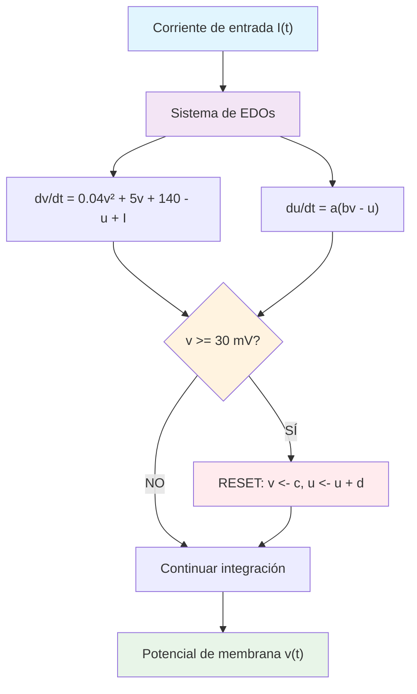

## Teoría

El modelo de Izhikevich se describe mediante el siguiente sistema de ecuaciones diferenciales ordinarias:

```
dv/dt = 0.04v² + 5v + 140 - u + I(t)    (1)
du/dt = a(bv - u)                        (2)
```

donde:
- **v** representa el potencial de membrana de la neurona (en mV)
- **u** es la variable de recuperación que modela la activación de corrientes K+ y la inactivación de corrientes Na+
- **I(t)** es la corriente de entrada externa
- **a, b, c, d** son parámetros adimensionales que determinan el tipo de comportamiento neuronal

El modelo incluye un mecanismo de reseteo que se activa cuando el potencial alcanza el umbral:

```
Si v >= 30 mV, entonces:
    v <- c
    u <- u + d
```

Los parámetros del modelo tienen el siguiente significado:
- **a**: Escala temporal de la variable de recuperación u
- **b**: Sensibilidad de u a las fluctuaciones subumbrales de v
- **c**: Valor de reseteo del potencial de membrana después del spike
- **d**: Incremento de la variable de recuperación después del spike


