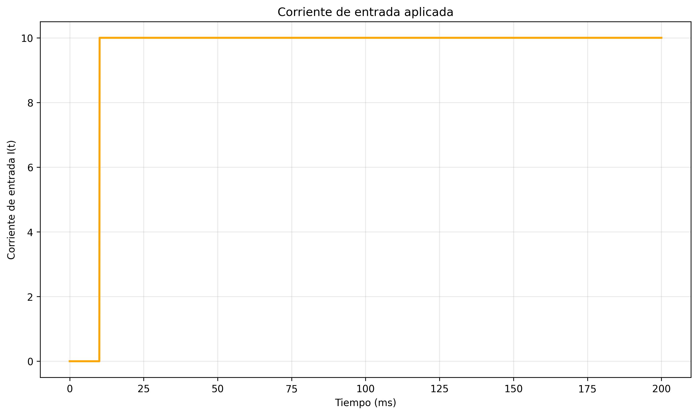
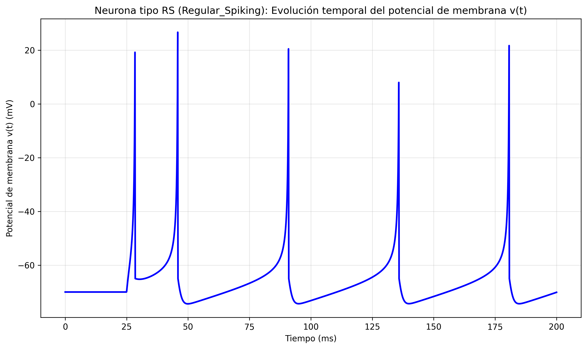
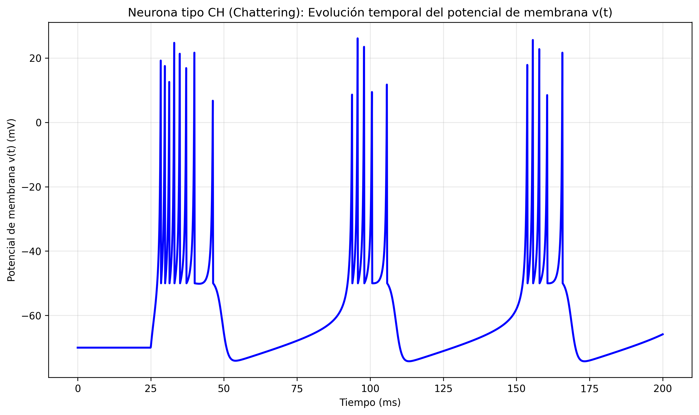
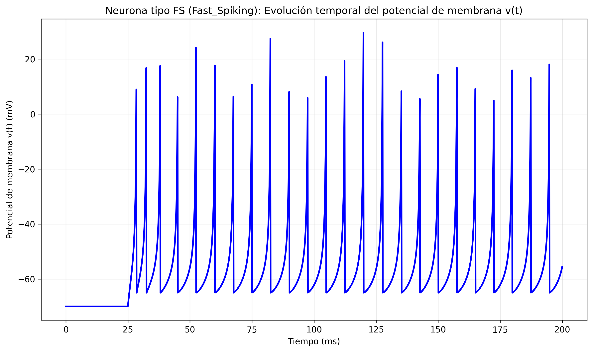
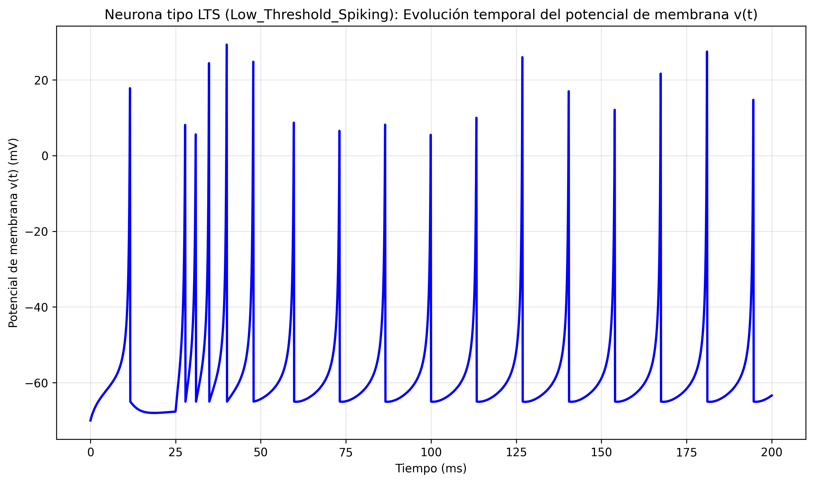
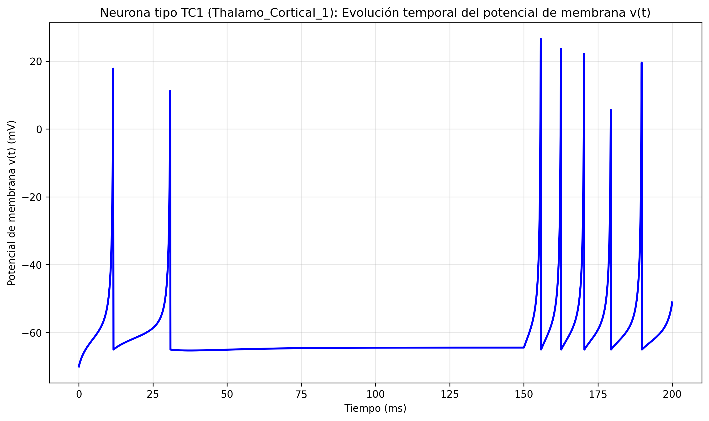
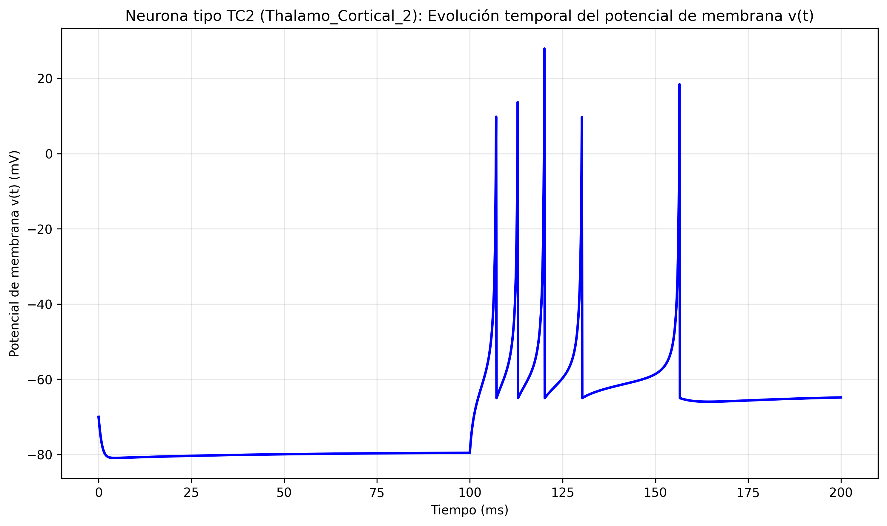
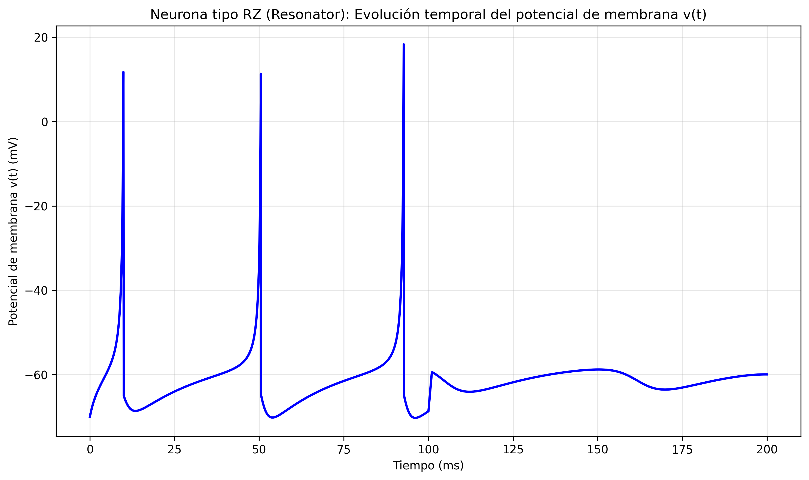

## Resultados

### Simulación básica del modelo

La simulación inicial del modelo con parámetros estándar muestra la evolución temporal del potencial de membrana y la variable de recuperación. Se observa que el sistema evoluciona hacia un estado estable sin disparos, lo cual es consistente con la ausencia de corriente de entrada en los primeros 10 ms de simulación.

*Figura 1: Simulación completa del modelo de Izhikevich mostrando la evolución temporal del potencial de membrana v(t), la variable de recuperación u(t), el espacio de fases (v vs u) y la corriente de entrada I(t).*

*Figura 2: Evolución temporal del potencial de membrana v(t) para parámetros estándar del modelo.*

*Figura 3: Evolución temporal de la variable de recuperación u(t) que modela la activación de corrientes K+ y la inactivación de corrientes Na+.*

*Figura 4: Espacio de fases (v vs u) mostrando la trayectoria del sistema en el plano de estado. El punto verde indica el estado inicial y el punto rojo el estado final.*

*Figura 5: Corriente de entrada I(t) aplicada al modelo. Se observa que la corriente se activa en t=10 ms con un valor de 10 unidades.*

### Reproducción de tipos neuronales

Se implementaron simulaciones para ocho tipos neuronales distintos según la parametrización del paper original de Izhikevich:

*Figura 6: Vista combinada de los ocho tipos neuronales simulados. Cada panel muestra la evolución temporal del potencial de membrana para diferentes parametrizaciones del modelo.*

**Neuronas excitatorias corticales:**

*Figura 7: Neurona RS (Regular Spiking) mostrando adaptación de frecuencia característica. Los intervalos entre spikes aumentan gradualmente.*

*Figura 8: Neurona IB (Intrinsically Bursting) exhibiendo bursting inicial seguido de disparos regulares.*

*Figura 9: Neurona CH (Chattering) presentando bursts de spikes muy cercanos temporalmente con alta frecuencia.*

**Neuronas inhibitorias corticales:**

*Figura 10: Neurona FS (Fast Spiking) disparando a alta frecuencia sin adaptación significativa.*

*Figura 11: Neurona LTS (Low Threshold Spiking) con alta frecuencia y adaptación moderada.*

**Neuronas talamocorticales:**

*Figura 12: Neurona TC1 mostrando respuesta tónica a corriente constante.*

*Figura 13: Neurona TC2 exhibiendo respuesta de rebote tras hiperpolarización.*

**Neuronas resonadoras:**

*Figura 14: Neurona RZ (Resonator) con oscilaciones subumbrales y comportamiento resonante.*
