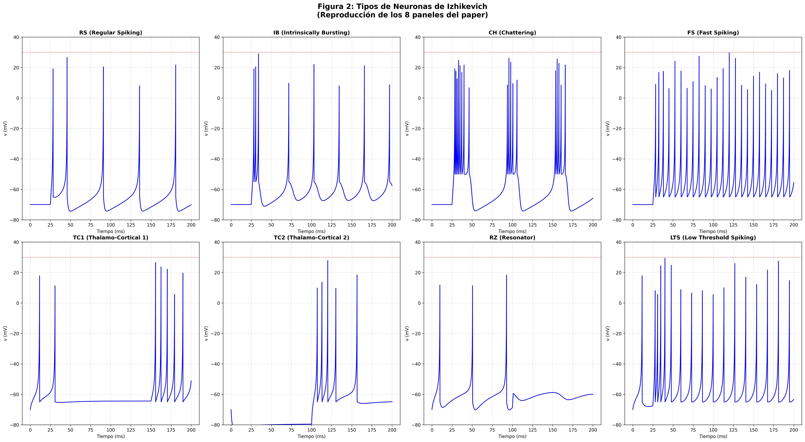

## Resultados

### Simulación básica del modelo

La simulación inicial del modelo con parámetros estándar muestra la evolución temporal del potencial de membrana y la variable de recuperación.

*Figura 1: Simulación completa del modelo de Izhikevich mostrando la evolución temporal del potencial de membrana v(t), la variable de recuperación u(t), el espacio de fases (v vs u) y la corriente de entrada I(t).*

### Reproducción de tipos neuronales

Se implementaron simulaciones para ocho tipos neuronales distintos según la parametrización del paper original de Izhikevich:

*Figura 6: Vista combinada de los ocho tipos neuronales simulados. Cada panel muestra la evolución temporal del potencial de membrana para diferentes parametrizaciones del modelo.*

**Neuronas excitatorias corticales:**

*Gráfico 1: Neurona RS (Regular Spiking) mostrando adaptación de frecuencia característica. Los intervalos entre spikes aumentan gradualmente.*

*Gráfico 2: Neurona IB (Intrinsically Bursting) exhibiendo bursting inicial seguido de disparos regulares.*

*Gráfico 3: Neurona CH (Chattering) presentando bursts de spikes muy cercanos temporalmente con alta frecuencia.*

**Neuronas inhibitorias corticales:**

*Gráfico 4: Neurona FS (Fast Spiking) disparando a alta frecuencia sin adaptación significativa.*

*Gráfico 8: Neurona LTS (Low Threshold Spiking) con alta frecuencia y adaptación moderada.*

**Neuronas talamocorticales:**

*Gráfico 5: Neurona TC1 mostrando respuesta tónica a corriente constante.*

*Gráfico 6: Neurona TC2 exhibiendo respuesta de rebote tras hiperpolarización.*

**Neuronas resonadoras:**

*Gráfico 7: Neurona RZ (Resonator) con oscilaciones subumbrales y comportamiento resonante.*
