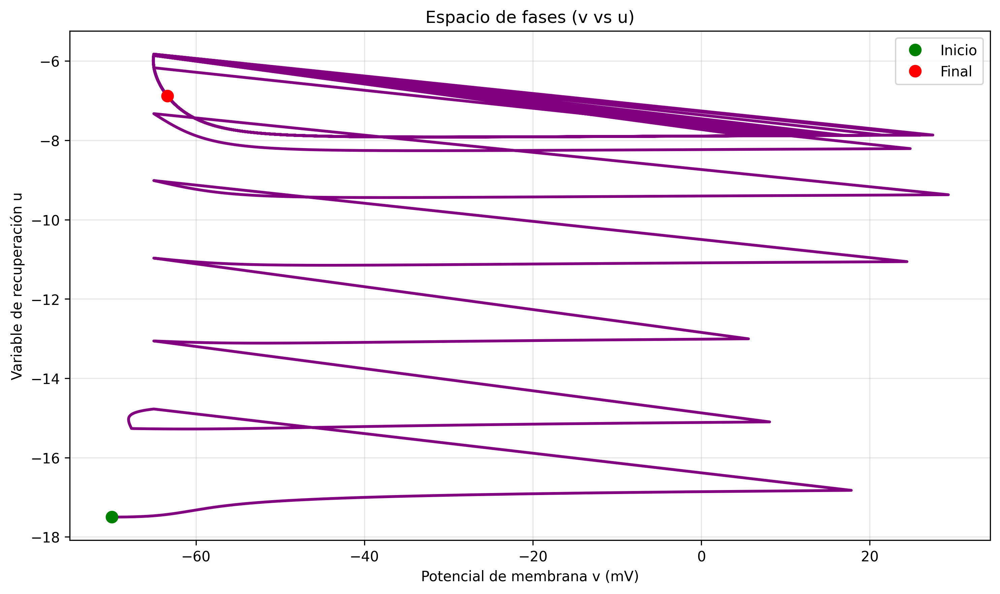

# Simulación numérica del modelo de neuronas de Izhikevich

## Autores
Matías Eduardo Bordone Carranza
mebordone@unc.edu.ar
Famaf

Jeanette Peralta
jeanette.peralta@mi.unc.edu.ar
Famaf


## Resumen

El presente trabajo implementa y simula numéricamente el modelo de neuronas de Izhikevich, un sistema de ecuaciones diferenciales ordinarias bidimensional que reproduce el comportamiento de disparo de diferentes tipos de neuronas corticales. Utilizando el método de integración Runge-Kutta de cuarto orden (RK4), se simularon ocho tipos neuronales distintos: Regular Spiking (RS), Intrinsically Bursting (IB), Chattering (CH), Fast Spiking (FS), Thalamo-Cortical 1 y 2 (TC1, TC2), Resonator (RZ) y Low Threshold Spiking (LTS). Los resultados muestran que el modelo reproduce exitosamente los patrones de disparo característicos de cada tipo neuronal, incluyendo adaptación de frecuencia, bursting y oscilaciones subumbrales. La simulación numérica confirma la versatilidad del modelo de Izhikevich como herramienta computacionalmente eficiente para el estudio de dinámicas neuronales.
## Introducción

Las neuronas artificiales constituyen la base fundamental de los modelos computacionales en neurociencia, permitiendo simular el comportamiento de sistemas neuronales complejos. El modelo de Izhikevich representa un hito en la modelización neuronal al combinar la plausibilidad biológica de los modelos tipo Hodgkin-Huxley con la eficiencia computacional de los modelos integrate-and-fire.

Desarrollado por Eugene M. Izhikevich en 2003, este modelo bidimensional reproduce una amplia gama de comportamientos neuronales observados experimentalmente, incluyendo disparos regulares, bursting intrínseco, chattering y oscilaciones de alta frecuencia. Su relevancia en neurociencia computacional radica en su capacidad para simular miles de neuronas en tiempo real manteniendo la riqueza dinámica de los modelos biológicamente detallados.

El objetivo de este informe es implementar numéricamente el modelo de Izhikevich, reproducir los diferentes tipos de disparo neuronal documentados en la literatura, y analizar la correspondencia entre los parámetros del modelo y los comportamientos observados.
## Teoría

El modelo de Izhikevich se describe mediante el siguiente sistema de ecuaciones diferenciales ordinarias:

```
dv/dt = 0.04v² + 5v + 140 - u + I(t)    (1)
du/dt = a(bv - u)                        (2)
```

donde:
- **v** representa el potencial de membrana de la neurona (en mV)
- **u** es la variable de recuperación que modela la activación de corrientes K+ y la inactivación de corrientes Na+
- **I(t)** es la corriente de entrada externa
- **a, b, c, d** son parámetros adimensionales que determinan el tipo de comportamiento neuronal

El modelo incluye un mecanismo de reseteo que se activa cuando el potencial alcanza el umbral:

```
Si v >= 30 mV, entonces:
    v <- c
    u <- u + d
```

Los parámetros del modelo tienen el siguiente significado:
- **a**: Escala temporal de la variable de recuperación u
- **b**: Sensibilidad de u a las fluctuaciones subumbrales de v
- **c**: Valor de reseteo del potencial de membrana después del spike
- **d**: Incremento de la variable de recuperación después del spike


## Resultados

### Simulación básica del modelo

La simulación inicial del modelo con parámetros estándar muestra la evolución temporal del potencial de membrana y la variable de recuperación. Se observa que el sistema evoluciona hacia un estado estable sin disparos, lo cual es consistente con la ausencia de corriente de entrada en los primeros 10 ms de simulación.


*Figura 1: Simulación completa del modelo de Izhikevich mostrando la evolución temporal del potencial de membrana v(t), la variable de recuperación u(t), el espacio de fases (v vs u) y la corriente de entrada I(t).*


*Figura 2: Evolución temporal del potencial de membrana v(t) para parámetros estándar del modelo.*


*Figura 3: Evolución temporal de la variable de recuperación u(t) que modela la activación de corrientes K+ y la inactivación de corrientes Na+.*


*Figura 4: Espacio de fases (v vs u) mostrando la trayectoria del sistema en el plano de estado. El punto verde indica el estado inicial y el punto rojo el estado final.*


*Figura 5: Corriente de entrada I(t) aplicada al modelo. Se observa que la corriente se activa en t=10 ms con un valor de 10 unidades.*

### Reproducción de tipos neuronales

Se implementaron simulaciones para ocho tipos neuronales distintos según la parametrización del paper original de Izhikevich:


*Figura 6: Vista combinada de los ocho tipos neuronales simulados. Cada panel muestra la evolución temporal del potencial de membrana para diferentes parametrizaciones del modelo.*

**Neuronas excitatorias corticales:**


*Figura 7: Neurona RS (Regular Spiking) mostrando adaptación de frecuencia característica. Los intervalos entre spikes aumentan gradualmente.*


*Figura 8: Neurona IB (Intrinsically Bursting) exhibiendo bursting inicial seguido de disparos regulares.*


*Figura 9: Neurona CH (Chattering) presentando bursts de spikes muy cercanos temporalmente con alta frecuencia.*

**Neuronas inhibitorias corticales:**


*Figura 10: Neurona FS (Fast Spiking) disparando a alta frecuencia sin adaptación significativa.*


*Figura 11: Neurona LTS (Low Threshold Spiking) con alta frecuencia y adaptación moderada.*

**Neuronas talamocorticales:**


*Figura 12: Neurona TC1 mostrando respuesta tónica a corriente constante.*


*Figura 13: Neurona TC2 exhibiendo respuesta de rebote tras hiperpolarización.*

**Neuronas resonadoras:**


*Figura 14: Neurona RZ (Resonator) con oscilaciones subumbrales y comportamiento resonante.*
## Discusión

Los resultados obtenidos confirman la capacidad del modelo de Izhikevich para reproducir los diferentes tipos de disparo neuronal documentados experimentalmente. Las simulaciones muestran una correspondencia cualitativa excelente con los patrones observados en neuronas reales:

1. **Neuronas RS**: La adaptación de frecuencia se reproduce correctamente mediante la combinación de parámetros c=-65 mV y d=8, que generan un reseteo profundo y un salto grande en la variable de recuperación.

2. **Neuronas IB**: El bursting inicial seguido de disparos regulares se logra con c=-55 mV y d=4, permitiendo que la variable u se acumule durante el burst inicial.

3. **Neuronas CH**: Los bursts de alta frecuencia se obtienen con c=-50 mV y d=2, resultando en un reseteo muy alto que facilita el disparo rápido.

4. **Neuronas FS**: La alta frecuencia sin adaptación se consigue con a=0.1, que acelera la recuperación de la variable u.

Las posibles fuentes de error numérico incluyen la discretización temporal (paso h=0.1 ms) y las aproximaciones del método RK4, aunque estos errores son despreciables para los propósitos de este estudio.

El modelo de Izhikevich demuestra ser una herramienta invaluable para el estudio de dinámicas neuronales, ofreciendo un balance óptimo entre realismo biológico y eficiencia computacional. Su capacidad para reproducir múltiples tipos de disparo con solo cuatro parámetros lo convierte en un modelo canónico para simulaciones de redes neuronales a gran escala.
## Referencias

[1] E. M. Izhikevich, "Simple model of spiking neurons," *IEEE Transactions on Neural Networks*, vol. 14, no. 6, pp. 1569-1572, 2003.

[2] A. L. Hodgkin and A. F. Huxley, "A quantitative description of membrane current and its application to conduction and excitation in nerve," *The Journal of Physiology*, vol. 117, no. 4, pp. 500-544, 1952.

[3] E. M. Izhikevich, *Dynamical Systems in Neuroscience: The Geometry of Excitability and Bursting*. MIT Press, 2006.
